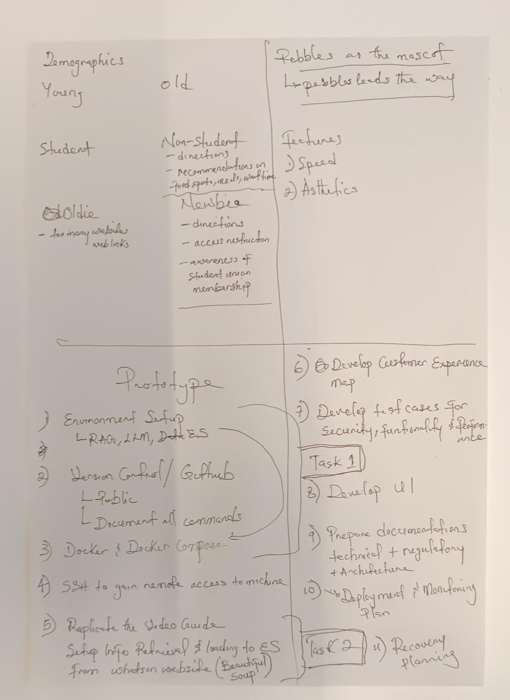

## 📌 Project Design Drafts  

Design drafts for reference:  

-   
-   

## 🚀 CI Strategy: Continuous Integration & Feature Flagging  

Our project follows a **Continuous Integration (CI) strategy** for version control, ensuring that changes are frequently merged, tested, and deployed with minimal disruptions. This approach allows us to maintain a stable codebase while accelerating development cycles.  

### 🔹 Key Benefits:  
- **Frequent Code Integration** – Developers commit changes regularly, reducing merge conflicts and improving collaboration.  
- **Feature Flagging for Safe Releases** – New features are deployed behind feature flags, enabling controlled rollouts, A/B testing, and quick rollbacks if needed.  
- **Faster & More Reliable Deployments** – Reduces deployment risks by ensuring only well-tested, stable features reach production.  

This approach enhances **agility, stability, and scalability**, enabling seamless innovation while minimizing risk. 🚀  

**More info**: https://medium.com/@pat2echo/dare-to-get-rapid-feedback-continuous-development-deployment-strategy-8516df6e9e26
